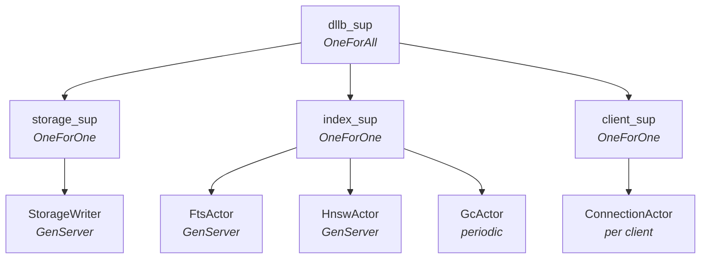
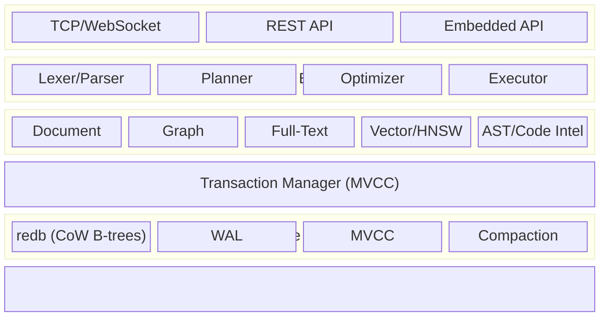

# Multi-Model NoSQL DBMS in Rust

## Problem Statement

Build from scratch a multi-model NoSQL database management system in Rust that
natively supports Documents, Graphs, Full-Text Search, and Vector Embeddings in
the prototype phase, with Reactivity, Geo-Spatial, and Object-Oriented concepts
deferred to later phases. The system must be a first-class store for AST/MetaAST
embeddings of source code, enabling semantic code search, structural similarity,
and cross-language code intelligence over graph-connected program structures.

## Effort Estimate

**Prototype (Documents + Graphs + Full-Text Search + Vector/AST Embeddings):**
~8-11 months for a solo experienced Rust developer, or ~4-5 months for a team
of 3. This assumes working evenings/weekends for solo; full-time for team. The
estimate covers a functional but not production-hardened system. The vector/AST
layer adds ~2 months to the original estimate.

**Full vision (all 6 models, production-grade):** 2-4 years with a dedicated
team of 3-5 engineers.

## Prior Art and Key Design Decisions

SurrealDB (Rust, multi-model over KV) demonstrated that encoding all data models
as structured key-value pairs in a single sorted KV store is the most elegant
approach. All "models" become different key layouts and query patterns over the
same byte stream. This is the architecture we adopt.

**Key decisions:**

- **Single KV substrate**: All data -- documents, graph edges, index entries,
  metadata -- stored as binary KV pairs in a sorted, transactional KV store
- **Tantivy for full-text**: Do not reinvent inverted indexes. Integrate Tantivy
  (Rust-native, Lucene-class, 15K+ stars, MIT) as the full-text indexing engine
- **redb for storage**: Pure-Rust, ACID, crash-safe embedded KV store using
  copy-on-write B-trees with MVCC. Zero C dependencies. Provides the
  transactional KV substrate; our `KvStore` trait wraps it. Can be replaced
  with a custom engine later if needed
- **MVCC**: Multi-version concurrency control for snapshot isolation from day one
- **Binary key encoding**: Hierarchical keys like SurrealDB
  (`/ns/db/table/type_tag/record_id`) enable prefix-scan queries, making graph
  traversals and document lookups the same primitive: range scans over contiguous
  byte slices
- **joerl actor system**: Erlang/OTP-inspired actor model for fault tolerance.
  Each subsystem (storage writer, full-text indexer, HNSW manager, client
  connections, background tasks) runs as a supervised actor. Supervision trees
  provide automatic restart on crash. GenServer call/cast semantics give
  structured access to stateful components. Actors are used for *management and
  coordination*, not for hot-path data access (KV reads, distance computation,
  query parsing remain direct function calls)

## Actor Architecture

The database runtime is structured as a joerl supervision tree:



**Actor roles:**

- `StorageWriter` -- GenServer owning the redb write transaction. Serializes all
  writes. Reads go directly through redb read transactions (no mailbox overhead).
  `call(Write{key, value})` -> `Ok(())`, `call(WriteBatch{ops})` -> `Ok(())`
- `FtsActor` -- GenServer managing Tantivy indexes. `call(Search{query})` returns
  results synchronously. `cast(UpdateIndex{doc_id, fields})` queues async index
  updates. Supervisor rebuilds index from KV on crash
- `HnswActor` -- GenServer managing HNSW graph state. `call(Knn{vec, k, ef})` for
  search, `cast(InsertVector{id, vec})` for index updates. Persists graph to KV
  periodically; supervisor replays journal on crash recovery
- `GcActor` -- Periodically runs MVCC garbage collection and redb compaction via
  `send_after`. Low-priority background work
- `ConnectionActor` -- One per TCP client, linked to its query execution context.
  Clean resource release on disconnect via link semantics
- `dllb_sup` -- Top-level supervisor. OneForAll: if storage dies, everything
  restarts (indexes must be consistent with storage)
- `index_sup` -- OneForOne: a crashed FTS or HNSW actor restarts independently

**What is NOT an actor (hot path):**

- Key encoding/decoding -- pure functions
- Distance computation (cosine, L2) -- pure compute, SIMD
- Query parsing -- stateless AST transformation
- KV reads within a transaction -- direct redb calls, no mailbox

## Architecture Overview



## Phase 1: Storage Engine Foundation (Weeks 1-4)

### 1.1 KV Store Interface

Define a `KvStore` trait abstracting over the storage backend:

- `get(key: &[u8]) -> Option<Vec<u8>>`
- `put(key: &[u8], value: &[u8])`
- `delete(key: &[u8])`
- `scan(start: &[u8], end: &[u8]) -> Iterator<(Vec<u8>, Vec<u8>)>`
- `transaction() -> Transaction` (begin/commit/rollback)

Implement the trait over `redb` (pure-Rust, ACID, MVCC, crash-safe B-trees).

### 1.2 Key Encoding Scheme

Design a binary key encoding where all models share one sorted keyspace. Type
tags in keys distinguish data types:

- `*` -- document record
- `~` -- graph edge pointer
- `+` -- index entry
- `!` -- metadata (schema, table definitions)

Key structure:
`[namespace][separator][database][separator][table][type_tag][record_id][...extra]`

Use length-prefixed or null-terminated encoding for variable-length segments.
Must preserve sort order.

### 1.3 Write-Ahead Log (WAL)

Append-only log for crash recovery. Each entry:
`[length][crc32][timestamp][operation][key][value]`. On startup, replay
uncommitted WAL entries.

### 1.4 Transaction Manager (MVCC)

- Each transaction gets a monotonically increasing timestamp
- Reads see only versions committed before the transaction's start timestamp
- Writes create new versions; conflict detection on commit (optimistic
  concurrency)
- Garbage collection of old versions based on watermark

## Phase 2: Document Model (Weeks 5-8)

### 2.1 Document Representation

- Internal format: custom binary encoding (MessagePack-like) or use `rmp-serde`
  for MessagePack
- External format: JSON for client communication
- Schema: support both schemaless (arbitrary JSON) and schemafull (typed fields
  with validation)
- Each document stored as:
  key=`[ns][db][table][*][record_id]`, value=serialized document bytes

### 2.2 Record IDs

- Composite: `table:id` (e.g., `user:tobie`)
- Auto-generated UUIDs or user-supplied
- Record ID is part of the KV key, enabling O(1) point lookups

### 2.3 CRUD Operations

- **CREATE**: serialize document, write to KV with new version timestamp
- **READ**: point lookup by record ID, or table scan via prefix range
  `[ns][db][table][*][0x00..0xFF]`
- **UPDATE**: read-modify-write with MVCC version bump
- **DELETE**: write tombstone marker, cleaned during compaction/GC

### 2.4 Secondary Indexes (B-Tree)

Define indexes on document fields. Index entries stored as KV pairs:

- Key: `[ns][db][table][+][index_name][field_value][record_id]`
- Value: empty or minimal metadata

Lookup: prefix-scan on `[...][+][index_name][target_value]` to find matching
record IDs, then fetch documents.

## Phase 3: Native Graph Model (Weeks 9-13)

### 3.1 Graph Edge Storage

Edges stored as KV pairs using the `~` type tag:

- Outgoing edge key:
  `[ns][db][table][~][src_id][edge_type][dst_id]` -> edge properties (serialized)
- Incoming edge key (reverse index):
  `[ns][db][table][~][dst_id][edge_type_rev][src_id]` -> empty

Both directions stored on write to enable bidirectional traversal. The reverse
key enables `<-edge<-` queries.

### 3.2 Graph Traversal Engine

- **BFS/DFS traversal**: given a starting vertex, scan the prefix
  `[...][~][vertex_id]` to find all outgoing/incoming edges
- **Multi-hop**: chain prefix scans;
  `A->knows->B->likes->C` is three sequential prefix scans
- **Path finding**: shortest path (Dijkstra/BFS), all paths, filtered paths
- **Pattern matching**: basic graph pattern matching (vertex-edge-vertex
  patterns)

### 3.3 Edge Properties

Edges are full documents -- they can carry arbitrary fields (weight, timestamp,
metadata). Stored as the value of the edge KV entry.

### 3.4 Graph-Specific Indexes

- Adjacency index: implicit via key structure (prefix scan = neighbor lookup)
- Property index on edges: secondary B-tree index on edge fields

## Phase 4: Full-Text Search (Weeks 14-17)

### 4.1 Tantivy Integration

Embed `tantivy` as a library dependency. For each table/field marked as
full-text indexed:

- Maintain a Tantivy `Index` on disk alongside the KV store
- On document write, tokenize the text field and update the Tantivy index
- On document delete, remove from Tantivy index

### 4.2 Full-Text Index Definition

User defines full-text indexes per field:

```sql
DEFINE INDEX ft_content ON article FIELDS content FULLTEXT ANALYZER english BM25;
```

Support configurable tokenizers (whitespace, stemming for multiple languages)
and scoring (BM25/TF-IDF).

### 4.3 Query Integration

Full-text queries compose with document and graph queries:

```sql
SELECT * FROM article
  WHERE content @@ 'distributed consensus'
  AND author->works_at->company.name = 'Acme';
```

The query planner decides whether to start from the full-text index or the graph
traversal based on estimated selectivity.

### 4.4 Synchronization

Keep Tantivy indexes consistent with the KV store:

- On commit: batch-update Tantivy index
- On crash recovery: rebuild Tantivy index from KV store (or use Tantivy's own
  WAL)
- Tantivy commit aligns with KV transaction commit

## Phase 5: Vector Embeddings and HNSW Index (Weeks 18-22)

This phase promotes vectors from a "future" feature to a core prototype
capability, driven by the AST/MetaAST code intelligence use case.

### 5.1 VECTOR Data Type

Introduce a native `VECTOR(dimensions)` field type:

- Stored as a contiguous `f32` array (4 bytes per dimension) in the document
  value
- Dimensions fixed per field definition (e.g., 384, 768, 1536)
- Supports `bf16` (2 bytes) storage option for memory efficiency (halves storage
  at minor precision loss)
- Serialization: raw IEEE 754 bytes -- no JSON overhead for internal storage

### 5.2 HNSW Index

Implement an HNSW (Hierarchical Navigable Small World) index for approximate
nearest neighbor search. Two options:

- **Option A (faster):** Use `hnsw_rs` crate or `anda_db_hnsw` as a dependency
- **Option B (full control):** Implement HNSW from scratch -- the graph layers
  map naturally onto the KV key scheme

For Option B, HNSW graph edges stored as KV pairs:

- Key: `[ns][db][table][+][hnsw_index_name][layer][node_id][neighbor_id]`
- Value: empty (the key itself encodes the edge)
- Entry point and layer metadata stored in the `!` metadata keyspace

Configurable parameters:

- `M` -- max connections per layer (default 16)
- `ef_construction` -- build-time beam width (default 200)
- `ef_search` -- query-time beam width (default 100)

### 5.3 Distance Metrics

Support multiple distance functions, selectable per index:

- **Cosine** -- standard for text/code embeddings
- **Euclidean (L2)** -- geometric similarity
- **Dot Product** -- for pre-normalized vectors
- SIMD acceleration (`std::simd` or `simsimd` crate) for distance computation
  in hot loops

### 5.4 Vector Query Syntax

```sql
-- Define a vector index
DEFINE INDEX embedding_idx ON ast_node FIELDS embedding HNSW DIMENSION 768 DIST COSINE;

-- KNN search: find 10 nearest, pre-filter by language
SELECT id, name, vector::distance::knn() AS dist
  FROM ast_node
  WHERE language = 'rust'
  AND embedding <|10,100|> $query_embedding
  ORDER BY dist;

-- Hybrid: vector + full-text + graph in one query
SELECT id, name,
    vector::distance::knn() AS vec_score,
    search::score(1) AS ft_score
  FROM ast_node
  WHERE embedding <|20,50|> $query_vec
  AND source_text @1@ 'async trait'
  AND ->calls->fn_node.module = 'core'
  ORDER BY (1.0 - vec_score) * 0.6 + ft_score * 0.4 DESC
  LIMIT 10;
```

The `<|K,ef|>` operator means: find K nearest neighbors with ef search beam
width.

### 5.5 Quantization (Stretch Goal)

- **Scalar quantization**: f32 -> u8 (4x compression, ~98% recall preserved)
- **Product quantization**: 8-32x compression via codebook-based subspace
  encoding
- Quantized vectors used for candidate pre-filtering; full-precision re-ranking
  on top-K

## Phase 5b: AST/MetaAST Code Intelligence Layer (Weeks 22-26)

This is the domain-specific layer that makes the database a first-class store
for program structure and code embeddings.

### 5b.1 AST Data Model

Source code maps onto the multi-model primitives as follows:

- **Documents**: each AST node (function, class, module, expression) is a
  document with fields like `name`, `kind`, `language`, `source_text`,
  `file_path`, `line_start`, `line_end`, `signature`, `docstring`, `metadata`
- **Graph edges**: structural relationships between AST nodes are graph edges:
  - `fn:parse->calls->fn:tokenize` (call graph)
  - `class:Parser->contains->fn:parse` (containment)
  - `fn:parse->returns->type:AST` (type relationships)
  - `module:parser->imports->module:lexer` (import graph)
  - `fn:parse_v2->overrides->fn:parse` (inheritance/override)
- **Embeddings**: each AST node carries one or more vector embeddings:
  - `source_embedding` -- embedding of the raw source text (e.g., CodeBERT
    768-dim)
  - `structure_embedding` -- embedding of the AST structure (tree-serialized,
    capturing syntax patterns)
  - `docstring_embedding` -- embedding of documentation/comments
- **Full-text**: source code and docstrings indexed for keyword search with a
  code-aware tokenizer

Predefined table schemas for common patterns:

```sql
DEFINE TABLE ast_node SCHEMAFULL;
DEFINE FIELD name        ON ast_node TYPE string;
DEFINE FIELD kind        ON ast_node TYPE string;  -- function, class, module, trait, etc.
DEFINE FIELD language    ON ast_node TYPE string;  -- rust, python, typescript, etc.
DEFINE FIELD file_path   ON ast_node TYPE string;
DEFINE FIELD line_start  ON ast_node TYPE int;
DEFINE FIELD line_end    ON ast_node TYPE int;
DEFINE FIELD source_text ON ast_node TYPE string;
DEFINE FIELD signature   ON ast_node TYPE string;
DEFINE FIELD docstring   ON ast_node TYPE string;
DEFINE FIELD source_embedding    ON ast_node TYPE vector(768);
DEFINE FIELD structure_embedding ON ast_node TYPE vector(384);

-- Indexes
DEFINE INDEX idx_kind     ON ast_node FIELDS kind;
DEFINE INDEX idx_lang     ON ast_node FIELDS language;
DEFINE INDEX idx_file     ON ast_node FIELDS file_path;
DEFINE INDEX src_vec      ON ast_node FIELDS source_embedding    HNSW DIMENSION 768 DIST COSINE;
DEFINE INDEX struct_vec   ON ast_node FIELDS structure_embedding HNSW DIMENSION 384 DIST COSINE;
DEFINE INDEX ft_source    ON ast_node FIELDS source_text FULLTEXT ANALYZER code BM25;
DEFINE INDEX ft_docstring ON ast_node FIELDS docstring   FULLTEXT ANALYZER english BM25;
```

### 5b.2 Code-Aware Tokenizer

Register a custom `code` analyzer for Tantivy that understands programming
constructs:

- Split on camelCase/snake_case boundaries (`parseJSON` -> `parse`, `json`;
  `parse_json` -> `parse`, `json`)
- Preserve meaningful operators and keywords
- Language-aware stop words (e.g., `self`, `this`, `return` are low-signal)
- Optional: preserve string literals and numeric constants as tokens

### 5b.3 MetaAST: Cross-Repository Structural Patterns

MetaAST is the abstraction layer above individual ASTs -- it captures recurring
structural patterns across repositories and languages:

- **Pattern nodes**: abstract representations like "error-handling-with-retry",
  "builder-pattern", "observer-pattern"
- **Pattern edges**:
  `ast_node:fn_retry->exemplifies->pattern:retry_with_backoff`
- **Pattern embeddings**: aggregated embeddings from all AST nodes that match a
  pattern, enabling "find code that follows the same pattern as this function"
- Stored as regular documents and graph edges -- the multi-model structure
  supports this natively without special-case code

### 5b.4 Signature Queries: Cross-Model Code Intelligence

The killer feature -- queries that combine all models in a single statement:

```sql
-- "Find functions similar to this one that are called by modules importing 'tokio'"
SELECT id, name, file_path, vector::distance::knn() AS similarity
  FROM ast_node
  WHERE kind = 'function'
  AND source_embedding <|20,100|> $my_fn_embedding
  AND <-contains<-module<-imports<-module[WHERE name CONTAINS 'tokio']
  ORDER BY similarity
  LIMIT 10;

-- "Find all implementations of the retry pattern across all languages"
SELECT id, name, language, file_path
  FROM ast_node
  WHERE ->exemplifies->pattern.name = 'retry_with_backoff'
  ORDER BY language, file_path;

-- "Find structurally similar code to a given snippet, ranked by hybrid score"
SELECT id, name,
    vector::distance::knn() AS struct_sim,
    search::score(1) AS text_match
  FROM ast_node
  WHERE structure_embedding <|30,100|> $snippet_structure_vec
  AND source_text @1@ 'async fn'
  ORDER BY struct_sim * 0.7 + text_match * 0.3 DESC
  LIMIT 20;
```

### 5b.5 Embedding Pipeline Integration

The database does NOT generate embeddings itself -- it stores and indexes them.
The embedding pipeline is external:

- Client generates embeddings using CodeBERT, StarCoder, OpenAI, or any model
- Client sends `CREATE ast_node SET source_embedding = [0.1, 0.2, ...], ...`
- The database indexes the vector into the HNSW graph transactionally
- Optional: a `DEFINE FUNCTION` hook that calls an external embedding service on
  document insert (post-prototype)

## Phase 6: Query Language and Engine (Weeks 27-32)

### 6.1 Query Language Design

SQL-like declarative language (similar to SurrealQL). Core syntax:

```sql
-- Documents
SELECT name, age FROM user WHERE age > 30;
CREATE user SET name = 'Alice', age = 30;
UPDATE user:alice SET age = 31;
DELETE user:alice;

-- Graphs
RELATE user:alice->purchased->product:widget SET quantity = 2;
SELECT ->purchased->product.name FROM user:alice;
SELECT ->knows[WHERE since > '2020']->name FROM user:alice;

-- Full-text
SELECT * FROM article WHERE content @@ 'rust database';

-- Cross-model
SELECT * FROM article
  WHERE content @@ 'graph database'
  AND author->works_at->company.country = 'US';
```

### 6.2 Parser

Use `nom` or `pest` crate for parsing. Produce an AST (Abstract Syntax Tree).

### 6.3 Query Planner and Optimizer

- Convert AST into a logical plan (scan, filter, project, join, sort, limit)
- Index selection: choose between table scan, B-tree index scan, full-text scan,
  or graph traversal based on available indexes and predicate selectivity
- Predicate pushdown: push filters as close to the scan as possible
- Limit pushdown: propagate LIMIT into scans

### 6.4 Executor

Streaming, batched execution model:

- `Scan -> Filter -> Project -> Sort -> Limit`
- Graph traversals integrated as scan operators
- Full-text queries dispatched to Tantivy, results merged with KV results
- Vector KNN queries: HNSW index produces candidate set, merged with other
  predicates
- Hybrid ranking: reciprocal rank fusion (RRF) or weighted linear combination of
  vector/text/graph scores

## Phase 7: Network and Client Layer (Weeks 33-35)

### 7.1 Protocol

- TCP server using `tokio` for async I/O
- Simple text protocol (like Redis RESP or a custom line-based protocol) for the
  prototype
- Optional: WebSocket support for browser clients

### 7.2 Embedded Mode

- The database is a Rust library crate that can be linked directly into an
  application
- No network overhead; direct function calls to the query engine

### 7.3 CLI REPL

- Interactive shell for issuing queries and inspecting results
- Command history, tab completion (using `rustyline`)

## Phase 8: Testing and Hardening (Weeks 36-40)

### 8.1 Unit Tests

- KV store operations, key encoding/decoding, MVCC correctness
- Document CRUD, graph traversal, full-text indexing
- HNSW index: insert, delete, KNN recall accuracy
- AST node CRUD with embedded vectors

### 8.2 Integration Tests

- End-to-end query execution (parse -> plan -> execute -> result)
- Crash recovery (kill process, restart, verify data integrity)
- Concurrent access (multiple readers/writers)
- Cross-model queries: vector + graph + full-text in one statement
- AST ingestion pipeline: parse code -> create nodes -> create edges -> index
  embeddings -> query

### 8.3 Benchmarks

- YCSB-style workloads (read-heavy, write-heavy, mixed)
- Graph traversal benchmarks (fan-out, depth)
- Full-text search benchmarks (latency, throughput)
- Vector search benchmarks: recall@10/100 vs. brute-force, latency at
  100K/1M/10M vectors
- Hybrid query benchmarks: combined vector+text+graph latency

## Future Phases (Post-Prototype)

### Reactivity

- LIVE SELECT: WebSocket-based subscriptions that push changes to clients
- DEFINE EVENT: triggers that fire on data mutations
- Changefeeds: ordered, durable mutation streams per table

### Geo-Spatial

- R-tree index for spatial data
- GeoJSON types (Point, Polygon, LineString)
- Distance, containment, intersection queries

### Object-Oriented

- Inheritance-like table relationships (e.g., `person` is a supertype of
  `employee`)
- Computed fields, field-level validation, type coercion
- Methods/functions attached to record types

## Rust Crate Dependencies (Prototype)

- `redb` -- pure-Rust ACID embedded KV store (copy-on-write B-trees, MVCC)
- `joerl` -- Erlang/OTP-inspired actor system (supervision, GenServer, links)
- `tantivy` -- full-text search engine
- `hnsw_rs` or custom -- HNSW approximate nearest neighbor index
- `simsimd` or `std::simd` -- SIMD-accelerated distance computation
- `half` -- bf16 float support for compact vector storage
- `serde`, `serde_json`, `rmp-serde` -- serialization
- `tokio` -- async runtime
- `nom` or `pest` -- query parser
- `uuid` -- record ID generation
- `crc32fast` -- checksums for WAL
- `bytes` -- efficient byte buffer manipulation
- `crossbeam` -- concurrent data structures
- `rayon` -- parallel batch operations (vector index building)
- `rustyline` -- CLI REPL
- `tracing` -- structured logging

## Project Structure

```
dllb/
  Cargo.toml
  crates/
    core/             -- Shared types (RecordId, Value, Error, Schema)
    storage/          -- KV store trait, redb backend, WAL, key encoding
    transaction/      -- MVCC, transaction manager, conflict detection
    document/         -- Document model, CRUD, secondary indexes
    graph/            -- Graph model, edge storage, traversal engine
    search/           -- Tantivy integration, full-text index management
    vector/           -- HNSW index, distance metrics, quantization, VECTOR type
    code-intel/       -- AST/MetaAST schemas, code-aware tokenizer, pattern matching
    query/            -- Lexer, parser, AST, planner, optimizer, executor
    server/           -- TCP/WebSocket server, protocol handling
    cli/              -- REPL client
```

## Risk Assessment

- **Highest risk**: Query planner complexity. A naive planner suffices for the
  prototype, but cross-model query optimization (choosing between graph traversal
  vs. full-text vs. vector narrowing) is genuinely hard research-level work. With
  vectors added, the planner must decide execution order among 4 access paths.
- **High risk**: HNSW index consistency. Keeping the HNSW graph transactionally
  consistent with the KV store during concurrent inserts/deletes is non-trivial.
  The HNSW graph is a stateful in-memory structure that must be durably persisted
  and recoverable.
- **Medium risk**: MVCC correctness under concurrent graph mutations. Graph edges
  create implicit multi-key dependencies.
- **Medium risk**: Hybrid scoring. Combining vector similarity, BM25 text
  relevance, and graph-based signals into a single ranking function requires
  careful normalization. RRF (Reciprocal Rank Fusion) is a solid default but may
  need tuning per use case.
- **Lower risk**: Tantivy integration. It is a well-documented, mature library.
- **Mitigation**: Start with single-threaded execution in the prototype. Add
  concurrency incrementally. Use redb transactions as the correctness anchor.
  For HNSW, persist the graph to the KV store and rebuild from KV on crash
  recovery (journal + replay approach). redb's built-in crash safety and
  savepoints simplify this significantly compared to RocksDB.
