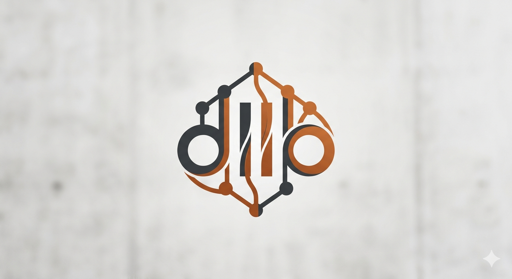
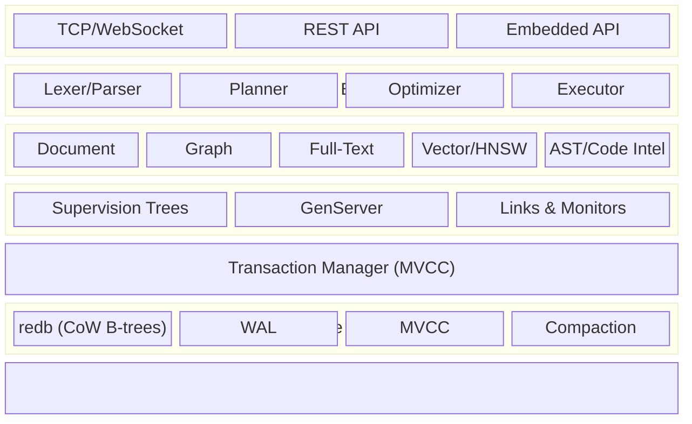
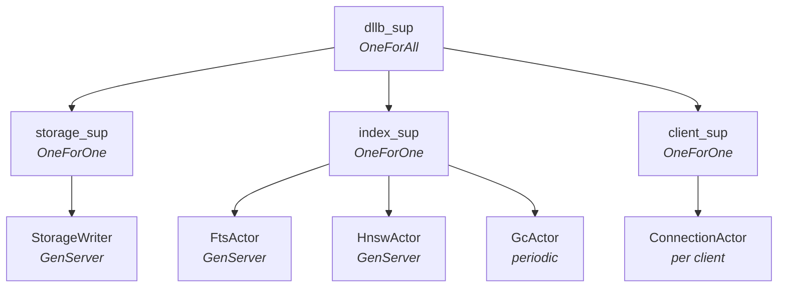

<p align="center">
  
</p>

<p align="center">
  <strong>A multi-model NoSQL database built from scratch in Rust.</strong><br/>
  Documents. Graphs. Full-Text Search. Vector Embeddings. One engine.
</p>

<p align="center">
  <a href="PLAN.md">Detailed Plan</a> &middot;
  <a href="docs/architecture.md">Architecture</a> &middot;
  <a href="docs/storage.md">Storage Engine</a> &middot;
  <a href="docs/crates.md">Crate Reference</a> &middot;
  <a href="#getting-started">Getting Started</a> &middot;
  <a href="#license">License</a>
</p>

---

## What is dllb?

**dllb** is a multi-model NoSQL database management system that natively supports
four data models in a single, unified engine:

- **Documents** -- schemaless or schemafull JSON/MessagePack records with
  secondary B-tree indexes
- **Native Graphs** -- first-class edges with properties, bidirectional
  traversal, BFS/DFS, path finding, and pattern matching
- **Full-Text Search** -- BM25-scored inverted indexes powered by
  [Tantivy](https://github.com/quickwit-oss/tantivy), with configurable
  analyzers and stemming
- **Vector Embeddings** -- HNSW approximate nearest neighbor index for dense
  vectors (cosine, L2, dot product), with SIMD-accelerated distance computation

All four models are stored as binary key-value pairs in a single sorted
keyspace backed by [redb](https://github.com/cberner/redb) (pure-Rust, ACID,
crash-safe, copy-on-write B-trees). Different "models" are simply different key
layouts and query patterns over the same byte stream.

### Why dllb?

Most real-world applications need more than one data model. A social network
needs documents (profiles), graphs (relationships), full-text (search), and
vectors (recommendations). The traditional answer is polyglot persistence --
stitching together MongoDB, Neo4j, Elasticsearch, and Pinecone. That means six
connection pools, six consistency models, six failure modes, and ETL pipelines
to keep them in sync.

dllb eliminates the seams. One query can combine a vector similarity search with
a graph traversal and a full-text match:

```sql
SELECT id, name,
    vector::distance::knn() AS vec_score,
    search::score(1) AS ft_score
  FROM ast_node
  WHERE embedding <|20,50|> $query_vec
  AND source_text @1@ 'async trait'
  AND ->calls->fn_node.module = 'core'
  ORDER BY (1.0 - vec_score) * 0.6 + ft_score * 0.4 DESC
  LIMIT 10;
```

### Code Intelligence First-Class Citizen

dllb is designed from the ground up as a first-class store for **AST and
MetaAST embeddings** of source code. Each AST node (function, class, module,
trait) is a document. Structural relationships (call graph, containment,
imports, type references) are graph edges. Code embeddings (CodeBERT,
StarCoder, etc.) are vectors. Source text and docstrings are full-text indexed
with a code-aware tokenizer that understands camelCase/snake_case boundaries.

This enables queries like:

```sql
-- Find functions similar to this one, called by modules importing 'tokio'
SELECT id, name, file_path, vector::distance::knn() AS similarity
  FROM ast_node
  WHERE kind = 'function'
  AND source_embedding <|20,100|> $my_fn_embedding
  AND <-contains<-module<-imports<-module[WHERE name CONTAINS 'tokio']
  ORDER BY similarity
  LIMIT 10;
```

## Architecture



### Actor-Based Fault Tolerance

The runtime is structured as a [joerl](https://crates.io/crates/joerl)
supervision tree -- an Erlang/OTP-inspired actor model providing automatic
crash recovery, isolated failure domains, and structured concurrency:



Actors manage stateful subsystems (storage writes, index maintenance, client
connections, background GC). Hot-path operations (key encoding, distance
computation, query parsing) remain direct function calls -- no mailbox overhead.

### Key Encoding

All data lives in a single sorted keyspace. Type tags in keys distinguish models:

| Tag | Byte | Purpose |
|-----|------|---------|
| `*` | 0x2A | Document record |
| `~` | 0x7E | Graph edge pointer |
| `+` | 0x2B | Index entry (B-tree, HNSW, full-text) |
| `!` | 0x21 | Metadata (schema, table definitions) |

Key structure:
`[namespace][0x00][database][0x00][table][tag][record_id][...extra]`

Graph traversals, document lookups, and index scans all reduce to the same
primitive: **prefix range scans** over contiguous byte slices.

## Project Structure

```
dllb/
  Cargo.toml              # Workspace manifest
  PLAN.md                 # Detailed implementation plan
  README.md               # This file
  crates/
    core/                 # RecordId, Value, Error, Schema, FieldType::Vector
    storage/              # KvStore trait, redb backend, WAL, key encoding
    transaction/          # MVCC, transaction manager, conflict detection
    document/             # Document model, CRUD, secondary indexes
    graph/                # Graph model, edge storage, traversal engine
    search/               # Tantivy integration, full-text index management
    vector/               # HNSW index, distance metrics, quantization
    code-intel/           # AST/MetaAST schemas, code-aware tokenizer
    query/                # Lexer, parser, planner, optimizer, executor
    server/               # TCP/WebSocket server (binary)
    cli/                  # Interactive REPL (binary)
```

## Technology Stack

| Component | Choice | Rationale |
|-----------|--------|-----------|
| Storage | [redb](https://github.com/cberner/redb) | Pure Rust, ACID, MVCC, crash-safe, zero C deps |
| Full-text | [Tantivy](https://github.com/quickwit-oss/tantivy) | Lucene-class, BM25, 15K+ stars, MIT |
| Actor system | [joerl](https://crates.io/crates/joerl) | Erlang/OTP supervision, GenServer, telemetry |
| Async runtime | [Tokio](https://tokio.rs) | Industry standard |
| Serialization | MessagePack + JSON | Compact internal, readable external |
| Vector math | SIMD (planned) | Hardware-accelerated distance computation |

## Getting Started

### Prerequisites

- Rust 1.89+ (edition 2024)
- Linux, macOS, or Windows

### Build

```bash
git clone <repo-url> dllb
cd dllb
cargo build --release
```

### Run the Server

```bash
cargo run --release -p dllb-server
```

### Run the CLI

```bash
cargo run --release -p dllb-cli
```

### Run Tests

```bash
cargo test --workspace
```

## Query Language

dllb uses a SQL-like declarative language inspired by SurrealQL:

```sql
-- Documents
CREATE user SET name = 'Alice', age = 30;
SELECT name, age FROM user WHERE age > 25;
UPDATE user:alice SET age = 31;
DELETE user:alice;

-- Graphs
RELATE user:alice->purchased->product:widget SET quantity = 2;
SELECT ->purchased->product.name FROM user:alice;

-- Full-text search
SELECT * FROM article WHERE content @@ 'distributed consensus';

-- Vector similarity (KNN)
SELECT id, vector::distance::knn() AS dist
  FROM ast_node
  WHERE embedding <|10,100|> $query_embedding
  ORDER BY dist;

-- Cross-model: all four in one query
SELECT id, name,
    vector::distance::knn() AS vec_score,
    search::score(1) AS ft_score
  FROM ast_node
  WHERE kind = 'function'
  AND embedding <|20,50|> $query_vec
  AND source_text @1@ 'async fn'
  AND ->calls->fn_node.module = 'core'
  ORDER BY vec_score * 0.6 + ft_score * 0.4 DESC
  LIMIT 10;
```

## Roadmap

### Prototype (In Progress)

- [x] Project structure and workspace setup
- [x] Core types (RecordId, Value, Schema, Error)
- [x] KvStore trait and key encoding
- [x] redb backend implementation
- [x] Document CRUD with MessagePack serialization, schema validation, secondary indexes
- [x] Graph edge storage and traversal (bidirectional, multi-hop walk, filtered)
- [x] Tantivy full-text integration (BM25 scoring, language stemming, multi-index)
- [x] HNSW vector index (distance metrics, brute-force baseline, in-memory HNSW with recall tests)
- [x] AST/MetaAST code intelligence layer (38 MetaAST node types, code tokenizer, schemas, extraction)
- [x] Query parser and executor (tokenizer, recursive-descent parser, direct executor)
- [x] TCP server and CLI REPL (tokio TCP, line protocol, JSON responses, rustyline REPL)

### Future

- Reactivity (LIVE SELECT, events, changefeeds)
- Geo-spatial (R-tree, GeoJSON)
- Object-oriented concepts (inheritance, computed fields)
- Distributed clustering via joerl's EPMD-based node discovery

## Contributing

Contributions welcome. See [PLAN.md](PLAN.md) for the detailed technical plan
and current phase.

## License

MIT
