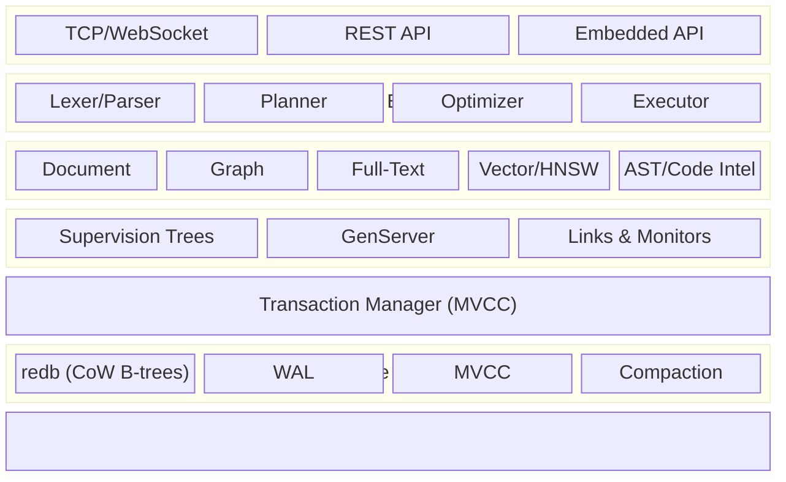
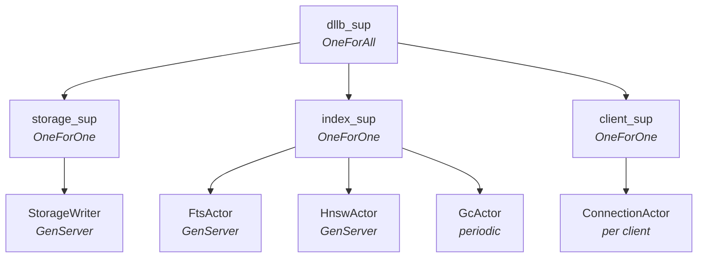

# Architecture

This document describes the layered architecture of dllb and how the
components interact.

## Layer Diagram



## Storage Engine

All data -- documents, graph edges, index entries, metadata -- is stored as
binary key-value pairs in a single redb database file. The `KvStore` trait
(`dllb-storage`) abstracts over the backend so it can be swapped later.

redb provides:
- ACID transactions (serializable isolation)
- MVCC: concurrent readers and a single writer, non-blocking
- Crash safety via copy-on-write B-trees (no separate WAL needed for redb itself)
- Compaction

### Key Encoding

All models share one sorted keyspace. Keys are structured as:

```
[namespace][0x00][database][0x00][table][0x00][tag][remainder...]
```

Type tags:

| Tag | Byte | Purpose |
|-----|------|---------|
| `!` | 0x21 | Metadata (schema, table definitions) |
| `*` | 0x2A | Document record |
| `+` | 0x2B | Index entry (B-tree, HNSW, full-text) |
| `~` | 0x7E | Graph edge pointer |

Byte values are chosen so their natural sort order is:
`metadata < document < index < graph_edge`.

Graph traversals, document lookups, and index scans all reduce to the same
primitive: **prefix range scans** over contiguous byte slices.

### Storage Writer Actor

Writes are serialized through a `StorageWriter` GenServer actor. This ensures:
- No concurrent write conflicts (redb allows only one writer at a time)
- Crash recovery via supervision: if the writer panics, the supervisor restarts it
- Backpressure via bounded mailbox

Reads bypass the actor entirely -- any thread can open a `read_txn` directly
from the shared `Arc<Database>` handle. This gives zero-overhead reads.

## Actor System

The runtime is structured as a joerl supervision tree:



### What is an actor vs. a direct call

| Actor (managed state, fault-tolerant) | Direct function (hot path) |
|----------------------------------------|---------------------------|
| StorageWriter (serializes writes) | KV reads (direct `read_txn`) |
| FtsActor (Tantivy index management) | Key encoding/decoding |
| HnswActor (vector index management) | Distance computation (cosine, L2) |
| GcActor (periodic MVCC cleanup) | Query parsing |
| ConnectionActor (per-client state) | Value serialization |

## Data Models

### Documents

Each document is a key-value pair:
- Key: `ns\0db\0table\0*record_id`
- Value: MessagePack-serialized fields

Schema can be `Schemaless` (arbitrary fields) or `Schemafull` (typed, validated).

### Graphs

Edges are stored as KV pairs with bidirectional keys:
- Outgoing: `ns\0db\0table\0~src\0edge_type\0dst` -> edge properties
- Incoming (reverse): `ns\0db\0table\0~dst\0edge_type_rev\0src` -> empty

Traversal is a prefix scan: scanning `~alice\0` finds all of Alice's edges.

### Full-Text Search

Powered by Tantivy. Each full-text index is a separate Tantivy `Index` on disk.
Updates are synchronized with KV commits via the `FtsActor`.

### Vector Embeddings

Dense vectors stored as `f32` arrays in document values. HNSW index for
approximate nearest neighbor search, managed by the `HnswActor`.

## Crate Dependency Graph

```mermaid
graph LR
  core["dllb-core"]
  storage["dllb-storage"]
  transaction["dllb-transaction"]
  document["dllb-document"]
  graph["dllb-graph"]
  search["dllb-search"]
  vector["dllb-vector"]
  codeintel["dllb-code-intel"]
  query["dllb-query"]
  server["dllb-server"]
  cli["dllb-cli"]

  storage --> core
  transaction --> core
  transaction --> storage
  document --> core
  document --> storage
  graph --> core
  graph --> storage
  search --> core
  vector --> core
  vector --> storage
  codeintel --> core
  query --> core
  query --> storage
  query --> document
  query --> graph
  query --> search
  query --> vector
  server --> core
  server --> storage
  server --> query
  cli --> core
  cli --> query
```
